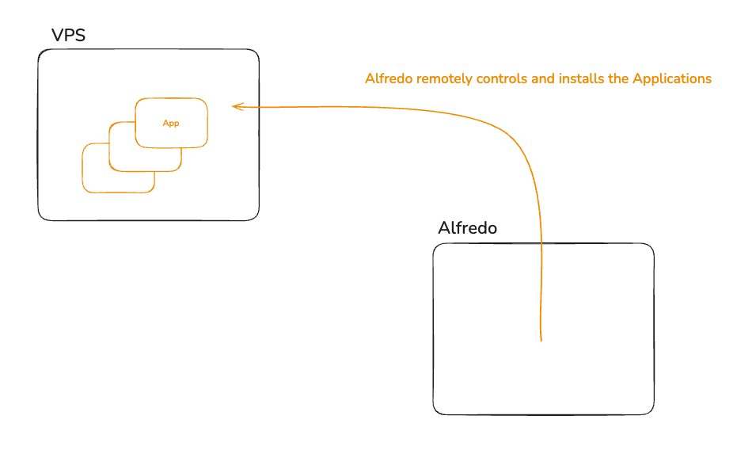

This is the developer documentation, based on the outline of the project.

It acts as a guide to understand how the project works, and how to contribute to it.

Alfredo is a self-hosting assistant that helps you to install applications on your server.

It lives in its own world (can be outside but also on the same server), and it remotely installs applications on your server.

We will now follow the Outline of the project to understand how it works.

### Provisioning the server

The server should be provisioned in a Cloud Provider, and we then add it to the Server list.

We now go to the Dashboard and add a Server. We introduce the server information, with credentials.

- We create a "Server" in our database, with the information we just introduced.
    - Username
    - Password (sudo password)
    - IP address
    - Port
    - Private SSH key (optional).
- We create an SSH key pair for it. (if it wasn't introduced)
- The goal now is to add the new SSH public key to the authorized keys of the server, so we can access it and start managing it.
    - For that, we can generate a simple "curl command" that gets the code to run from out running server.
      Example: `curl -ssL https://getalfredo.com/my-script | bash`
- To run this command, in the local VM, use the `run tunnel` command in `local-vm` folder.
    - It will connect to the VM while creating a tunnel, so that we can access our host easily.
      The 8080 port on the server will be mapped to 8080 on our local machine.
- After logging in , we paste that command in the terminal, and we install the SSH key for the user.
- We can now go to Alfredo dashboard, and continue the workflow.
